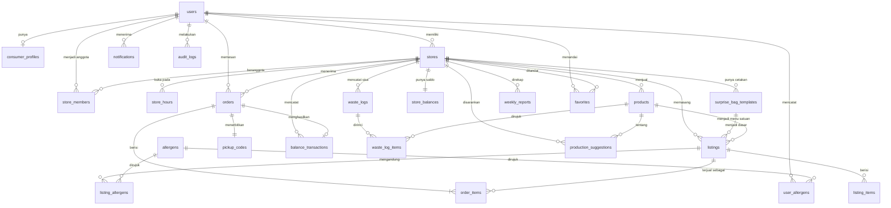

# ERD — Life of Foods

24 tabel proyek, ditambah tabel bawaan Laravel (`users`, `sessions`, `cache`,
`jobs`, `personal_access_tokens`, `migrations`).

Sumber kebenaran skema adalah berkas di `api/database/migrations/`.
Dokumen ini menjelaskan bentuk dan alasannya; kalau keduanya berbeda,
migrasi yang benar dan dokumen ini yang harus diperbaiki.

## Empat kelompok

| Kelompok | Tabel | Pertanyaan yang dijawab |
|---|---|---|
| Identitas | `users`, `consumer_profiles`, `otp_codes`, `user_allergens`, `allergens`, `store_members` | Siapa yang masuk, dan boleh berbuat apa |

Pengguna masuk lewat dua jalur: nomor HP + OTP (`users.phone`, `otp_codes`)
atau akun Google (`users.google_sub`, ADR-0006). Karena itu `users.phone`
nullable; satu akun bisa punya salah satu atau keduanya.
| Katalog | `stores`, `store_hours`, `products`, `surprise_bag_templates`, `listings`, `listing_items`, `listing_allergens` | Apa yang dijual hari ini |
| Transaksi | `orders`, `order_items`, `pickup_codes`, `store_balances`, `balance_transactions` | Siapa memesan apa, dan sudah diambil belum |
| Arah B | `waste_logs`, `waste_log_items`, `weekly_reports`, `production_suggestions` | Berapa yang terbuang, dan bagaimana menguranginya |
| Pendukung | `notifications`, `favorites`, `audit_logs` | Pemberitahuan, penanda, dan jejak |

## Diagram

## Jalur yang paling sering dilewati

Alur beli, tujuh tabel:

`listings` → `orders` → `order_items` → `pickup_codes`
→ saat kode ditukar: `orders.status`, `listings.qty_sold`,
`balance_transactions`, `store_balances`, `audit_logs`.

Alur Arah B, empat tabel:

`waste_logs` + `waste_log_items` → agregasi terjadwal → `weekly_reports`
→ `production_suggestions`.
