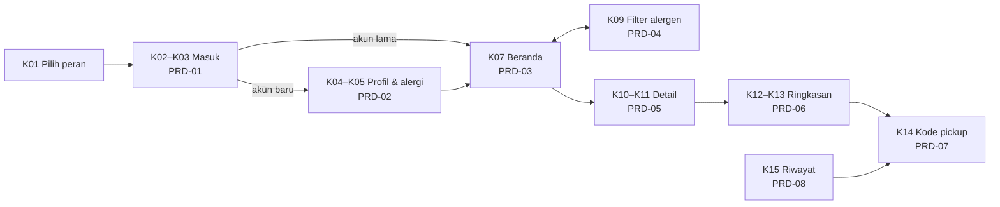
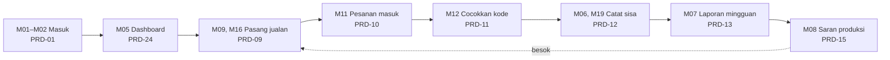

# PRD Life of Foods

PRD menjawab **apa dan kenapa**. Cara teknisnya ada di dokumen lain:

| Dokumen | Menjawab |
|---|---|
| `docs/prd/` (folder ini) | Tujuan fitur, cerita pengguna, alur layar, kriteria penerimaan |
| `docs/figma/peta-layar.md` | Layar Figma mana untuk fitur apa |
| `docs/api/kontrak-api.md` | Endpoint, body, respons, kode galat |
| `docs/adr/` | Keputusan teknis beserta alasannya |
| `db/kamus-data.md` | Aturan data yang tidak terlihat dari nama kolom |

PRD ini ditulis setelah sebagian besar API selesai, jadi isinya disusun dari rencana awal **dan** dicocokkan dengan kode di `main` per 29 September 2026. Kalau PRD dan kode berbeda, kode yang berlaku untuk perilaku yang sudah jalan, dan PRD yang berlaku untuk tujuan. Perbaiki salah satunya di PR yang sama.

## Arti status kriteria

| Status | Arti |
|---|---|
| **Diuji** | Ada tes fitur API yang membuktikannya; nama tesnya disebut |
| **Ada di kode** | Sudah dibangun, tapi belum ada tes khusus |
| **Perlu dicek** | Layarnya sudah ada, tapi kriteria ini belum diperiksa |
| **Belum** | Belum dibangun |

## Daftar fitur

| Kode | Fitur | Prioritas | PRD | API | Android |
|---|---|---|---|---|---|
| F-01 | Masuk nomor HP + OTP | MUST | [PRD-01](PRD-01-masuk-otp.md) | Selesai | K01–K03, M01–M02 ada |
| F-02 | Lengkapi profil + profil alergi | MUST | [PRD-02](PRD-02-profil-alergi.md) | Selesai | K04, K05 ada |
| F-03 | Beranda katalog surplus | MUST | [PRD-03](PRD-03-beranda.md) | Selesai | K07 ada |
| F-04 | Filter alergen | MUST | [PRD-04](PRD-04-filter-alergen.md) | Selesai | Belum |
| F-05 | Detail jualan | MUST | [PRD-05](PRD-05-detail-jualan.md) | Selesai | K10, K11 ada |
| F-06 | Ringkasan pesanan + catatan | MUST | [PRD-06](PRD-06-ringkasan-pesanan.md) | Selesai | Belum |
| F-07 | Kode pickup | MUST | [PRD-07](PRD-07-kode-pickup.md) | Selesai | Belum |
| F-08 | Riwayat pesanan | MUST | [PRD-08](PRD-08-riwayat-pesanan.md) | Selesai | Belum |
| F-09 | Mitra pasang tas dan menu satuan | MUST | [PRD-09](PRD-09-pasang-jualan.md) | Selesai | Belum |
| F-10 | Pesanan masuk mitra | MUST | [PRD-10](PRD-10-pesanan-masuk.md) | Selesai | Belum |
| F-11 | Cocokkan kode pickup | MUST | [PRD-11](PRD-11-cocokkan-kode.md) | Selesai | Belum |
| F-12 | Catat sisa harian, dua mode | MUST | [PRD-12](PRD-12-catat-sisa.md) | Selesai | Belum |
| F-13 | Laporan mingguan | MUST | [PRD-13](PRD-13-laporan-mingguan.md) | Selesai | Belum |
| F-14 | Peta dan jarak tanpa API key | SHOULD | [PRD-14](PRD-14-peta-jarak.md) | Selesai | Belum |
| F-15 | Saran produksi | SHOULD | [PRD-15](PRD-15-saran-produksi.md) | Selesai | Belum |
| F-16 | Kasir dan pengaturan toko | SHOULD | [PRD-16](PRD-16-kasir-dan-toko.md) | Selesai | Belum |
| F-17 | Saldo baca saja | SHOULD | [PRD-17](PRD-17-saldo.md) | Selesai | Belum |
| F-18 | Notifikasi dan pengingat ambil | SHOULD | [PRD-18](PRD-18-notifikasi.md) | Selesai | Belum |
| F-19 | Profil dan pengaturan konsumen | SHOULD | [PRD-19](PRD-19-profil-pengaturan.md) | Selesai | Belum |
| F-24 | Dashboard mitra | SHOULD | [PRD-24](PRD-24-dashboard-mitra.md) | Selesai | Belum |
| F-25 | Masuk dengan Google | SHOULD | [PRD-25](PRD-25-masuk-google.md) | Selesai | Tombol ada |

Fitur COULD tidak dibuatkan PRD. Rujukannya cukup kontrak API:
F-20 unggah foto (belum ada endpoint) · F-21 pencarian teks (sudah ada lewat parameter `q` di `GET /listings`) · F-22 favorit (API selesai, kontrak §5) · F-23 profil toko publik · K23 pusat bantuan.

WON'T selama pilot: Midtrans (K21), voucher (K22), pendaftaran mitra mandiri (M03, M04), pencairan dana (M20), fitur sosial, push FCM, mode offline, panel admin web.

## Alur utama

**Pembeli.** Satu jalur dari membuka aplikasi sampai makanan diambil.

**Mitra, satu hari kerja.** Arah B: jual yang tersisa, catat yang terbuang, lalu kurangi besok.

Kedua alur bertemu di satu titik: kode di **K14** milik pembeli diketik kasir di **M12**.

## Irisan vertikal minggu 5

Target: `K01 → K02 → K03 → K07 → K10 → K12 → K14`, lalu `M11 → M12`.

Sudah ada di Android: K01, K02, K03, K07, K10. **Tersisa: K12, K14, M11, M12.** API untuk keempatnya sudah selesai dan diuji, jadi sisa pekerjaannya murni di Android.

## Celah yang perlu diputuskan tim

1. **Belum ada uji dua pembeli memesan unit terakhir bersamaan.** Penguncian baris sudah ada di `LayananPesanan`, tapi belum ada bukti otomatis. Rencana awal menandainya sebagai uji paling menentukan. Lihat PRD-06.
2. **Jualan tanpa data alergen lolos filter.** Filter hanya menyembunyikan jualan yang ditandai. Kalau mitra lupa mencentang alergen, jualannya tampil sebagai aman. Lihat PRD-04 dan PRD-09.
3. **Publikasi jualan belum masuk `audit_logs`.** Penukaran kode, catat sisa, perubahan toko, dan keanggotaan sudah tercatat; publikasi belum. Lihat PRD-09.
4. **Mitra tidak bisa membatalkan pesanan** kalau stok fisiknya ternyata habis. Lihat PRD-10.
5. **Filter vegetarian dan diet lain belum bisa**, karena jualan belum punya penanda diet. Lihat PRD-04.

## Mengubah PRD

- Perilaku produk berubah? Ubah PRD-nya di PR yang sama dengan kodenya. Template PR sudah punya centang untuk ini.
- Tes baru ditulis? Naikkan status kriterianya menjadi **Diuji** dan sebut nama tesnya.
- PRD baru memakai kerangka: tabel ringkas (fitur, tujuan, layar, API, status) → Cerita pengguna → Alur → Kriteria penerimaan → Kosong dan galat → Di luar lingkup → Catatan.
